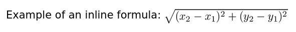
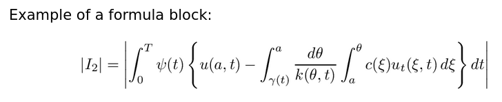
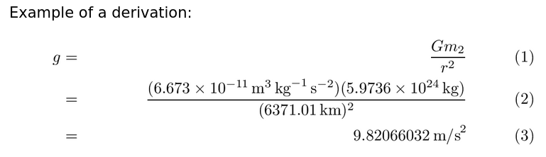

Doxygen Usage Guidelines
========================

The tool used for API documentation is "Doxygen." Although designed for use
with C++ it does offer some support for Fortran. This page explains how it is
used in the LFRic project.

An Introduction to API Documentation
~~~~~~~~~~~~~~~~~~~~~~~~~~~~~~~~~~~~

Before we start considering specific recommendations it is important to
understand what API documentation is for.

Doxygen will check every source file and build up a web site of API
documentation. This presents each public entity (types, parameters, procedures)
and describes what it is for and how to use it.

The documentation is used by people who want to take advantage of the existing
code which implements some functionality they desire. They have not read the
code, they do not know how it works, nor should they have to. Everything they
need to know to make use of it should be in the API document.

Generally speaking you should not put implementation details in the API
document. The user of your function doesn't care that you've stored data in a
sliding heap. All they want to know is what they put in and what they get out.

Because we deal with mathematical models it may be appropriate to include the
equation that a particular function implements if that is the purpose of the
function.

Using Doxygen
~~~~~~~~~~~~~

API documentation is identified by the use of special comment blocks. Entities
which may be documented are:

* Program units

  * Public types

    * Public type-bound parameters
    * Public type-bound variables
    * Public type-bound procedures

  * Public parameters
  * Public variables
  * Public procedures

You will notice that all the documentable entities are public. This is the
nature of API documentation, if it is private then it is not part of the API.
You might find it useful to document private entities in the same way for
consistency but must bear in mind that although it looks the same it is
internal developer documentation. That is, documentation for the people who
develop a project, not those who use it.

Documentation Comment Blocks
----------------------------

The special comment blocks are placed before the entities they refer to and are
signified by ``!>``. Documentation which spans multiple lines should be
continued with either repeated uses of ``!>`` or ``!!``.

Variables and parameters are a special case where it is sometimes neater to
place the documentation immediately following their declaration. This is
supported with the ``!<`` special comment.

Structural Markup
-----------------

Doxygen implements a simple mark-up language to denote meaning in your special
comments. Tags in this markup are preceded by ``@`` or ``\``.

There is a `rich selection`_ of structural markup tags for a wide variety of
uses. As is often the case there is a much smaller subset which get frequent
use.

.. _rich selection: http://www.doxygen.nl/manual/htmlcmds.html

Descriptions
............

The first tag to consider is ``\brief``. This is used to indicate that the
following phrase should be used when describing the entity in lists. As the
name suggests it is a brief description and will tend to appear in
conjunction with the entity's name.

If the ``@brief`` tag is not provided then the first sentence of the comment
block will be used.

Any other text in the comment is considered part of an extended description.
This will be used as part of the canonical definition of the entity.

Every entity which may be given a brief description must have one but it is not
necessary to provide an extended description.

Procedures
..........

There are 2 tags which are essential when documenting procedures. These are
``\param`` and ``\return``. They are used for documenting the values passed
into and returned by the procedure.

The first takes the following form::

    \param[(in|out|in,out)] <argument name> <description>

Although Fortran provides the "direction" information with the ``intent``
attribute Doxygen is currently unable to take advantage of it so you must
specify it by hand.

Functions may make use of this tag::

    \return <description>

This is used to describe the value returned from the function.

Deprecation
...........

You may follow the ``\deprecated`` tag with an explanation as to why the entity
is deprecated, what should be used instead and how long continued support may
be expected.

Formatting Markup
-----------------

In addition to the structure markup, "`Markdown`_" markup is supported for
embellishing the textual content.

Markdown is a simple method for indicating emphasis, pre-formatted text, lists,
tables and suchlike. It is inspired by conventions developed for wikis.

.. _Markdown: http://www.doxygen.nl/manual/markdown.html

Mathematics
-----------

Doxygen can also handle LaTeX formula descriptions. To include them inline
surround with `\f$`. This should always be the case for ``@brief``
descriptions::

    Example of an inline formula: \f$\sqrt{(x_2-x_1)^2+(y_2-y_1)^2}\f$

When you need them centred on the page use ``\f[`` and ``\f]``::

    Example of a formula block:

    \f[
        |I_2|=\left| \int_{0}^T \psi(t)
              \left\{
                  u(a,t)-
                  \int_{\gamma(t)}^a
                  \frac{d\theta}{k(\theta,t)}
              \int_{a}^\theta c(\xi)u_t(\xi,t)\,d\xi
              \right\} dt
              \right|
    \f]

If you want to show a derivation you can use ``\f{align}{`` and ``\f}``::

    Example of a derivation:

    \f{align}{
        g &=& \frac{Gm_2}{r^2} \\
          &=& \frac{(6.673 \times 10^{-11}\,\mbox{m}^3\,\mbox{kg}^{-1}\,
              \mbox{s}^{-2})(5.9736 \times 10^{24}\,\mbox{kg})}{(6371.01\,\mbox{km})^2} \\
          &=& 9.82066032\,\mbox{m/s}^2
    \f}

Guidelines
~~~~~~~~~~

Remember that the documentation generated from these comments is intended to
allow someone else to pick up your code and use it without having to examine
the actual code. They should provide sufficient information on procedure
function and arguments that someone can make use of the module quickly and
easily. Clearly there is an assumption that any prospective user has the
knowledge to understand what the module does. You do not have to provide a
primer on advanced fluid dynamics.

While implementation details are not appropriate, algorithmic details may be.
This is particularly true of scientific code which may be implementing a
particular method. Make a judgement.

If you are implementing the Newton-Raphson method then it would be entirely
appropriate to describe that method in the comments. If you are *using* the
Newton-Raphson method then it should almost certainly not be mentioned as it
may be replaced by a different method at a later date.

Don't just repeat the entity name. This can be hard as well written code gives
variables and procedures meaningful names however there is no value to simply
repeating that information in the comment. Remember the declaration code will
also appear in the final documentation so the reader has that already. Instead
embellish with additional information which is not applicable to the label::

    real, parameter :: GRAVITY !< Acceleration due to gravity in m/s^2

Phrases may be used in favour to whole sentences where brevity is important.
This is especially relevant in brief and argument descriptions.

The Problem With Modules
------------------------

Fortran modules are particularly problematic since they are really just scoping
units. This means that a module which holds a type has the same purpose as that
type and therefore the same description.

In these cases favour the type itself with the majority of the verbiage. The
module description is there purely to aid discovery of the type.

The Problem With Type-bound Procedures
--------------------------------------

Doxygen was originally written for C++ and modelled after the "Javadoc" tool
provided with the Java language. As such it makes assumptions which are not
necessarily true for Fortran. The most frustrating of these is around
type-bound procedures.

Doxygen pulls the documentation from the type declaration as that is where it
gets it for C++. Unfortunately Fortran does not declare the procedure in the
type declaration but simply refers to it.

You can document the procedure in the type definition but then the
documentation is divorced from the declaration. This makes divergence more
likely.

It also does not handle overloaded procedures where there are several different
calling signatures for the same procedure name.

For these two reasons we recommend putting the documentation with the procedure
implementation even though it won't show in the generated documentation. The
hope is that a future version of Doxygen will fix this problem.

Doxygen Comments Dos and Don'ts
-------------------------------

These guidelines have been heavily informed by some of the original
`Sun (Now Oracle) documentation`_.

+----------------------------------------------------------------------+--------------------------------------------------------------------------------+----------------------------------------------------------------------------------------------------------------------+
| Directive                                                            | Do                                                                             | Don't                                                                                                                |
+======================================================================+================================================================================+======================================================================================================================+
| Keep the brief description brief, it is used in summaries            | ``!> @brief Calculates wayneshaft from cardinal grammeters.``                  | ``!> @brief Takes cardinal grammeters one to four and, by means of complicated maths, produces a wayneshaft value.`` |
+----------------------------------------------------------------------+--------------------------------------------------------------------------------+----------------------------------------------------------------------------------------------------------------------+
| Don't just repeat the label                                          | ``function get_cheese() !< Gets the type of cheese currently in this fridge.`` | ``function get_cheese() !< Function to get the cheese.``                                                             |
+----------------------------------------------------------------------+--------------------------------------------------------------------------------+----------------------------------------------------------------------------------------------------------------------+
| Use 3rd person declarative rather than 2nd person imperative         | ``!> Gets a teapot from this cupboard.``                                       | ``Get a teapot from this cupboard.``                                                                                 |
+----------------------------------------------------------------------+--------------------------------------------------------------------------------+----------------------------------------------------------------------------------------------------------------------+
| Use a verb phrase for type-bound procedures                          | ``!> Gets this monkey's boots.``                                               | ``!> The boots this monkey is wearing.``                                                                             |
+----------------------------------------------------------------------+--------------------------------------------------------------------------------+----------------------------------------------------------------------------------------------------------------------+
| Use "this" in preference to "the" when referring to the current type | ``!> Gets the functionspace this field resides on.``                           | ``!> Gets the functionspace the field resides on.``                                                                  |
+----------------------------------------------------------------------+--------------------------------------------------------------------------------+----------------------------------------------------------------------------------------------------------------------+
| Don't include unnecessary subjects                                   | ``!> Vegetation fraction.``                                                    | ``!> Variable holding vegetation fraction.``                                                                         |
+----------------------------------------------------------------------+--------------------------------------------------------------------------------+----------------------------------------------------------------------------------------------------------------------+
| Don't Doxygen ``program`` blocks, they are not part of the API       | ``! Command line widget generator.``                                           | ``!> Command line widget generator.``                                                                                |
+----------------------------------------------------------------------+--------------------------------------------------------------------------------+----------------------------------------------------------------------------------------------------------------------+
| Don't Doxygen private members. They get ordinary comments.           | ``! Internal state (private) variable``                                        | ``!> Internal state variable, never processed by Doxygen.``                                                          |
+----------------------------------------------------------------------+--------------------------------------------------------------------------------+----------------------------------------------------------------------------------------------------------------------+
| Tests are not part of the API, don't use Doxygen on them.            |                                                                                |                                                                                                                      |
+----------------------------------------------------------------------+--------------------------------------------------------------------------------+----------------------------------------------------------------------------------------------------------------------+
| PSykal-light code is temporary and should not be Doxygened.          |                                                                                |                                                                                                                      |
+----------------------------------------------------------------------+--------------------------------------------------------------------------------+----------------------------------------------------------------------------------------------------------------------+

.. _Sun (Now Oracle) documentation: http://www.oracle.com/technetwork/articles/java/index-137868.html

An Example
~~~~~~~~~~

Here is a fanciful example to illustrate some of the points made in the
preceding document:

.. code-block:: fortran

    !> @brief Non-academic magical practices.
    !!
    !! This includes hedge magic and wicca but not shamanism. It also does not cover formalised
    !! magical practices such as the Hermetic tradition or Cabalism.
    !!
    !! @see ritual_magic_mod and formal_magic_mod for alternative traditions.
    !!
    module simple_magic_mod

      !> \brief As practised by the witches of lore.
      !>
      !> Warts are not required for this.
      !>
      type hedge_type
        ...
      end hedge_type

      !> @brief Practises of the New Age movement.
      !>
      type wicca_type
        ...
      end wicca_type

    contains

      !> @brief Invokes a magical effect using the hedge tradition.
      !>
      !> \param[in] spell  Effect sought.
      !> \param[in] duration  Number of seconds the effect should last for.
      !> \param[in,out] tea  Hot beverage supply modified by the amount
      !>                     sacrificed to magical workings.
      !>
      subroutine hedge_cast( this, spell, duration, tea )
        implicit none
        integer(enum_spell), intent(in)     :: spell
        integer(seconds),    intent(in)     :: duration
        type(tea_type),      intent(in,out) :: tea
        ...
      end subroutine hedge_cast

      !> @brief Determines the skill required of the practitioner for a particular
      !> magical effect.
      !>
      !> Only the minimum proficiency requirements are returned. Hubris
      !> may prevent a more skilled practitioner from achieving a particular effect.
      !>
      !> @param[in] spell  Effect to gauge the difficulty of.
      !> @return Minimum level of ability required for the supplied effect. A zero
      !>         value indicates that this school can not achieve the effect.
      !>
      function wicca_proficiency( self, spell ) result( level )
        implicit none
        integer(enum_spell), intent(in) :: spell
        integer :: level
        ...
      end function wicca_proficiency

    end module simple_magic_mod
