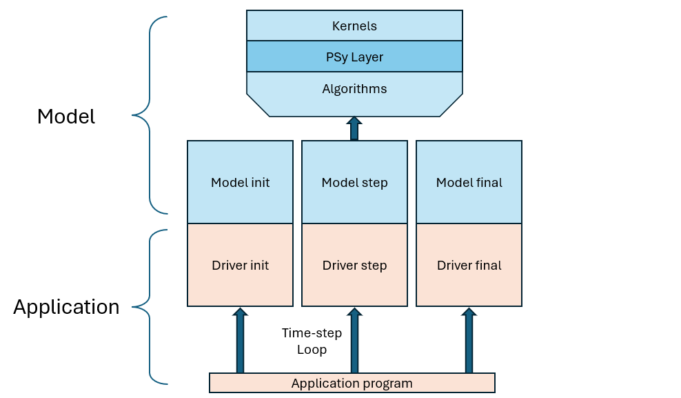

.. -----------------------------------------------------------------------------
     (c) Crown copyright 2024 Met Office. All rights reserved.
     The file LICENCE, distributed with this code, contains details of the terms
     under which the code may be used.
   -----------------------------------------------------------------------------

.. _application structure:

Application Structure
=====================

The LFRic software includes core software for creating and using model
fields and :ref:`LFRic component <components>` software that
is intended to support the creation of different model applications
that all have a similar structure. This section describes a typical
LFRic application that runs a single scientific model: the model is
the core science code that could, in principle, be used in different
applications, whereas the application is all the code used to compile
a single executable.

The LFRic code repository includes the ``simple_diffusion``
application which demonstrates some aspects of a single-model LFRic
application. The Momentum\ :sup:`®` atmosphere application, maintained
separately, is another example but is much more complex. Both
applications read configuration information, can read input data, set
up and call the science model code to integrate field data on model
meshes over multiple time-steps, output diagnostics, and output
checkpoint dumps. The ``simple_diffusion`` application is used for
training purposes and is designed to be as simple as possible while
demonstrating some key aspects of a scientific model. In comparison,
the Momentum\ :sup:`®` atmosphere application supports many more
technical configuration options such as the ability to run with mixed
precision and mixed resolution components, and includes code that
couples to the NEMO ocean model.

.. _application_schematic:

   Schematic of an application that runs a single science model. The
   application program calls the ``init``, ``step`` and ``final`` stages of
   the driver layer to set up data structures and infrastructure data
   (such as mesh coordinate information) required by the model. Each
   stage calls the respective ``init``, ``step`` and ``final`` stages of the
   model which read, integrate and write the scientific data.

Running the Model
-----------------

The top-level program calls each of the application driver layer
procedures. The :ref:`driver layer <driver layer overview>`
comprises an initialise, step and finalise procedure. Each procedure
of the driver layer calls the initialise, step and finalise procedures
of the model.

The application driver layer procedures may be based on the LFRic
:ref:`driver component <driver component>` code which aim to
support common requirements of running a typical science model in a
single-model application. Where the component does not meet all of an
application's requirement, for example, when the application is
coupling two models together, some or all of the driver layer code may
be bespoke.

Prior to calling the driver initialise stage, data structures shared
by each stage of the model need to be set up. The LFRic driver layer
component provides a :ref:`modeldb <modeldb>` data
structure that aims to store all the data needed to run a
model. Properly encapsulating all the data allows applications to
create multiple ``modeldb`` data structures to run two or more models
side by side, or to run ensembles of the same model side by side.

When a model uses ``modeldb``, certain information must be set up prior
to calling the driver layer initialisation. Examples include setting
up the configuration from the namelist inputs, defining the model name
and setting the MPI communicator. This behaviour is intended to
support the capability for the model to be run in an ensemble context,
or alongside another model, where the models run sequentially or
concurrently.

Evolution of the model is driven by calling the application driver
step the required number of times, typically controlled by ticks of
the :ref:`model clock <model time>` held in ``modeldb``.

Once all steps are executed, the application finalise stage is called
after which processes instantiated by the application prior to
initialisation can be finalised.

.. _driver layer overview:

The driver layer
----------------

This section briefly describes the role of the initialise, step and
finalise stage of a simple application driver layer. As many
applications will share common ways of driving the models they use, a
:ref:`Driver component <driver component>` has
been created that contains standard modules that can be used to help
construct an application.

Driver Initialise
^^^^^^^^^^^^^^^^^

The `driver initialise` stage of an application can roughly be divided
between initialising the infrastructure of the model (including
infrastructure data about meshes, coordinates, clocks and calendars)
and initialising the initial model data that represents the current
state of the model (reading dumps and ancillary files). Some of the
driver initialise work involves calls to procedures provided by the
model. The processes required for initialising the application are
separated into multiple model procedures to give applications
flexibility in setting up models. For example, where several models
use the same or similar meshes, an application can ensure each mesh
needs to be read only once.

The model infrastructure data typically comprises information about
meshes and coordinates that are fixed throughout the model run, as
well as some fixed data. The model state comprises fields and data
that evolve as the model runs. Data held in the model state needs to
be initialised, either from input data or by computing or choosing
values.

The driver initialisation may also initialise scientific components
that are used by the model.

Driver Step
^^^^^^^^^^^

The `driver step` stage will execute a single time-step of the model
starting at the input date and lasting for a period defined by a
time-step length.  The driver step is responsible for calling the
model step that integrates the model data forward one time-step, but
will also be responsible for managing infrastructure such as reading
input data from ancillary files or from a coupler, writing some
diagnostic data and writing checkpoint dumps.

Driver Finalise
^^^^^^^^^^^^^^^

The `driver finalise` stage will undertake any necessary finalisation
processes, noting that much of the model data may go out of scope as
soon as the driver layer finalise has completed.

The model API
-------------

Mirroring the structure of the driver layer, the model layer will have
initialise, step and finalise stages.

Model Initialise
^^^^^^^^^^^^^^^^

As noted above, the `model initialise` stage may be broken into several
separate procedures to allow for flexibility in application design.

On completion of initialisation, the internal model data structures
should be fully-set up in readiness to run a model timestep.

Model Step
^^^^^^^^^^

The model step will evolve the model prognostics forward by one
timestep.

Model Finalise
^^^^^^^^^^^^^^

The finalise stage will finalise any objects created in the initial
stage.

Data in a model
---------------

In many other model infrastructures, "fields" refer to simple native
Fortran arrays of data representing some physical quantity over the
spatial domain of the model. In contrast, fields in LFRic are created
as :ref:`LFRic field_type <field>` Fortran derived-types. Alongside
the data representing the field's physical quantity, the field type
encapsulate other information about the field, and provides functions
for accessing information about the field. Understanding the role of
the `field_type` is critical to understanding LFRic, but the details
are deferred to the section describing the :ref:`use of PSyclone and
the LFRic data model<psykal and datamodel>`. For now, the
distinction between LFRic fields and the simpler fields of other
models will mostly be ignored so as to focus on the broader model
structure.

A complex model such as the Momentum\ :sup:`®` atmosphere requires
hundreds of fields. To simplify the model design, the LFRic
infrastructure supports :ref:`field collections <field
collection>`. A field collection can store arbitrarily-large numbers
of fields that can be accessed by name. The Momentum\ :sup:`®`
atmosphere has several field collections holding fields for each of
several major science components. Use of field collections makes the
API of higher-level science algorithms more manageable by hiding both
the large number of fields and the fact that some fields are not
required for all model configurations.

.. Link to configuration object to `namelist_collection_type` in developer
   guide when available.

A `configuration object` stores the model configuration derived from the input
namelists file. It contains input values for real variables, science options,
switches, etc. Configuration settings can be accessed by first accessing the
`namelist object(s)` in the `configuration object`, then requesting the desired
namelist variable (see :ref:`Accessing configuration data<access_config_data>`).

A :ref:`key-value <keyvalue pair object>` data structure exist
that stores an arbitrary number of key-value pairs where the value can
be an object of any type. At a basic level, this data structure can
store native fortran types such as real or integer variables and
arrays. More complex abstract or concrete types can also be stored.

The `modeldb` object defined in the `driver` component provides the
ability to store all of the above data structures. A list of the main
data structures declared in `modeldb` is given here. For more details
on how to use these data structures see the :ref:`modeldb <modeldb>`
documentation.

 - **field**: an object that can store fields and field collections. A
   field or field collection can be accessed from `field` by name.
 - **configuration** An instance of the configuration object described
   above, which stores the model configuration: input values, science
   options, switches and so forth.
 - **values** An instance of the key-value data structure described
   above that can store any type or class which can be accessed by
   name.
 - **mpi** Stores an object that can be used to perform MPI tasks.
 - **clock** and **calendar** objects can track model time.

While all algorithms in an LFRic model will rely on fields, to retain
a degree of separation between the model and the infrastructure it is
recommended that accesses to `modeldb` do not go too deep into the
code: once an algorithm is sufficiently self-contained, all its inputs
can be extracted from `modeldb` and passed to the algorithm through
the subroutine API.

Operators
^^^^^^^^^

A brief mention of operators is sufficient in this document: an
operator is a data structure that can be used to map a field of one
type onto another type. Its use is relevant to the GungHo mixed finite
element formulation where there is a need to map fields between
different function spaces.

Algorithms, Kernels and the PSy layer
-------------------------------------

The architecure of an LFRic science model follows the PSyKAl design
which stands for PSy (Parallel Systems) layer, Kernels and ALgorithms
that form the core parts of the scientific code of a model. Broadly
speaking, algorithms are higher-level subroutines that deal only with
full fields. The data in fields is encapsulated and cannot directly be
accessed within an algorithm. Kernels are lower level subroutines that
have access to the data in fields passed by the algorithm and
implement the actual computations of the data requested by the
algorithm.

The PSy layer sits between algorithms and kernels. It breaks open
fields and feeds their data to kernels. The PSy layer gets its name
from the fact that shared-memory parallelism can be applied at this
level; for example, applying OpenMP loops over calls to the kernel
with different chunks of the field data.

PSyclone
--------

The implementation of the PSyKAl design lies at the heart both of the
concepts of the separation of concerns that LFRic aims to support and
the portable performance goals that LFRic aims to deliver.

Critically, these goals are supported by the PSyclone application
which autogenerates the PSy layer code using information and metadata
parsed from algorithms and kernels and applying optional
transformations to optimise the code.

The structure of algorithms and kernels, and the use of PSyclone is
the subject of the major section describing the :ref:`LFRic data model
and its use of PSyclone <psykal and datamodel>`.
