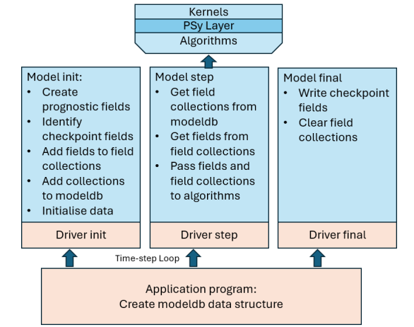

.. -----------------------------------------------------------------------------
     (c) Crown copyright 2024 Met Office. All rights reserved.
     The file LICENCE, distributed with this code, contains details of the terms
     under which the code may be used.
   -----------------------------------------------------------------------------

.. _prognostics:

Prognostic Fields
=================

In an earth system model, the fields that exist throughout a model run
are often referred to as the "prognostic fields". For some such
fields, it is essential that they exist during the whole run as they
contain the true model state. For other fields, implementing them as
prognostic fields can be a practical convenience where fields are
shared between more than one area of the model or where they are set
by reading in data from file.

The LFRic infrastructure provides support and recommendations for
creating and managing the model prognostic state for applications
aligned with the :ref:`standard LFRic model application structure
<application structure>`. In such applications, fields are
created and initialised during the initialisation phase and stored in
the ``modeldb`` data structure either as fields or within :ref:`field
collections <field collection>`.

In the time-step phase of the model, field collections and fields are
extracted from ``modeldb`` and passed to science code through the
argument list.

The following figure expands on the figure found in the
:ref:`application structure section <application structure>`
to illustrate the role of each stage of a model in creating and using
prognostic fields.

   Illustrates the role of each stage of a model when dealing with
   prognostic fields.

.. topic:: Examples of prognostic fields

   #. Fields such as wind, potential temperature, density and moisture
      are physical quantities at the core of the numerical simulation
      of an atmosphere model. Such fields need to be initialised at
      the beginning of a model run, exist until the run completes, and
      be written to any checkpoint files.
   #. Some fields may be initialised from file data. It is often
      convenient to read files at the start of a run to keep the IO
      code separate from the scientific code. Hence, like prognostics,
      the fields need to be initialised at the beginning of the run. But
      they do not need to be written to a checkpoint file as the
      original file can be read again when the model restarts.
   #. Where a field is passed from one section of science to another
      (such as from radiation to boundary layer) it can be convenient
      to treat it as a prognostic field: to allocate it alongside the
      above prognostic fields at the start of the run rather than
      within the time-step code. If the field is to be passed across a
      time-step boundary then it will also need to be written to a
      checkpoint file.

Detailed recommendations
------------------------

For a simple model with a few prognostic fields, adding them directly
to ``modeldb`` may be appropriate. For a complex model with very many
prognostic fields and several science components, use of field
collections can reduce the size of argument lists to science routines
that require a lot of fields.

Fields can be referenced by more than one field collection, meaning
two sections of code can share the same field even if they do not use
the same field collection.

Note: to reference a field in more than one field collection it is
stored as an actual field in just one of the collections and all other
field collections store a pointer to the field. To simplify the
decision making about which of several field collections should hold
the actual field, it is recommended that all the actual prognostic
fields are added to a single large ``depository`` field collection,
and that all other field collections hold pointers to the fields they
need. While the ``depository`` field collection maintains the fields
in scope through the run, it is not otherwise referred to in the
model.

In summary, in the initialisation phase, for each field, the following
steps are recommended.

 #. If the field is a prognostic it needs to be initialised and added
    to the ``depository`` field collection.
 #. To pass each field to the science sections that need it, a pointer
    to the field is added to relevant field collections passed down
    the calling tree to the science code.
 #. Field collections can be dedicated to technical requirements
    too. For example, if the field needs to be checkpointed, a pointer
    to the field can be added to a field dedicated to holding
    checkpoint/restart fields.
 #. The field should be initialised with the appropriate mesh and
    function space according to the model configuration.

During the time-step running stage of the model, field collections and
fields set up at initialisation time can be extracted from the
``modeldb`` and passed into the relevant scientific algorithms and
kernels.

Code illustration
^^^^^^^^^^^^^^^^^

The following code snippets illustrate examples of creating fields,
and adding them to field collections.

At the start of the initialisation process, field collections are
added to ``modeldb``

.. code-block:: fortran

   call modeldb%fields%add_empty_field_collection("depository")
   call modeldb%fields%add_empty_field_collection("conv_fields")
   call modeldb%fields%add_empty_field_collection("checkpoint_fields")

The field collections are then accessed:

.. code-block:: fortran

   type(field_collection) :: depository, conv_field, checkpoint_fields
   type(field_type)          :: rain

   ! Get the field collections from the modeldb
   depository => modeldb%fields%get_field_collection("depository")
   conv_fields => modeldb%fields%get_field_collection("conv_fields")
   checkpoint_fields => modeldb%fields%get_field_collection( &
                                             "checkpoint_fields")

Having obtained the field collections, fields need to be added to
them. The following adds a ``rain`` field to the convection
scheme. The ``rain`` field is a cell-centred single-layer field in the
model, so is represented by the :math:`\mathbb{W}_{3}` function space
on the 2-dimensional mesh.

A couple of temporary pointers are needed to enable the field to be
added to more than one field collection.

.. code-block:: fortran

   type(field_type), pointer :: fld_ptr
   class(pure_abstract_field_type), pointer :: tmp_ptr

   ! rain is a 2D field on the W3 function space
   function_space => function_space_collection%get_fs( mesh2d,          &
                                                       element_order_h, &
                                                       element_order_v, W3 )
   call rain%initialise(function_space, name='rain')

   ! Add actual field to depository
   call depository%add_field(rain)

   ! Get a pointer to the field
   call depository%get_field(rain, field_ptr)

   ! Use an abstract field pointer, as field collections can hold any field type
   tmp_ptr => field_ptr

   ! Add the field pointer to the radiation collection
   call conv_fields%add_reference_to_field(tmp_ptr)

   ! If convection scheme is in use,  checkpoint this field
   if (convection == convection_um) then
     call checkpoint_fields%add_reference_to_field(tmp_ptr)
   end if

Now that the fields are in the field collections and the field
collections are in ``modeldb`` they can be accessed from anywhere in
the model. For example:

.. code-block:: fortran

   subroutine step(modeldb)

     type(field_collection_type), pointer :: conv_fields
     type(field_type), pointer :: rain

     conv_fields => modeldb%fields%get_field_collection("conv_fields")
     call conv_fields%get_field('rain',rain)

     call convection_science(rain,...

During the finalise stage of a model, a procedure in the
:ref:`lfric_xios component <lfric xios component>` can be called and
passed the field collection containing the fields that need to be
checkpointed. After the fields are checkpointed, the collections can
be cleared.

.. code-block:: fortran

   use lfric_xios_write_mod, only : write_checkpoint

   depository => modeldb%fields%get_field_collection("depository")
   conv_fields => modeldb%fields%get_field_collection("conv_fields")
   checkpoint_fields => modeldb%fields%get_field_collection("checkpoint_fields")

   call write_checkpoint( checkpoint_fields, modeldb%clock, filename )

   call depository%clear()
   call conv_fields%clear()
   call checkpoint_fields%clear()

The code to initialise fields and add them to field collections is
quite verbose, but a lot of it is repeated almost identically for each
field. Generic functions can therefore be written to simplify the
code, particularly for models that have many prognostic fields. The
next section describes how the Momentum\ :sup:`®` atmosphere model has
modularised some of the functionality both to simplify code and reduce
the potential for errors.

Example: The Momentum\ :sup:`®` Model
-------------------------------------

In the Momentum\ :sup:`®` atmosphere model, the set-up of the
prognostics field is based on metadata written in the XIOS
``iodef.xml`` file. The XIOS metadata describes the output form of the
field from which the model form (the function space) of the field can
be inferred. The Momentum\ :sup:`®` atmosphere model prognostic code
can use this metadata to simplify the prognostic initialisation code.

In the Momentum\ :sup:`®` atmosphere model, a routine called
``create_physics_prognostics`` includes the code for creating most of
the prognostic fields, including dealing with some of the steps
described in the preceding section.

The following code initialises a field called ``albedo_obs_vis``, adds
it to the ``depository`` field collection, adds a pointer to it to the
radiation field collection and, depending on the model configuration,
to the checkpoint field collection. Other than checking whether the
field needs to be checkpointed and which field collection to add the
field to, much of the code is hidden in the ``apply`` function.

.. code-block:: fortran

   if (surface == surface_jules .and. albedo_obs) then
     checkpoint_flag = .true.
   else
     checkpoint_flag = .false.
   end if
   call processor%apply(make_spec('albedo_obs_vis', main%radiation, &
                                  ckp=checkpoint_flag))

While the ``apply`` function used for the Momentum\ :sup:`®` model is
somewhat bespoke, its capabilities are generic and could be adaptable
to other model requirements including models that do not use XIOS.

.. topic:: The apply method

   Due to the way XIOS operates, Momentum's
   ``create_physics_prognostics`` routine is called twice. The first
   call and the second call use different ``processor`` types each of
   which have different ``apply`` methods.

   Applications that use XIOS define what are known as XIOS
   "contexts". A context supports a particular set of input or output
   requests. The first call to ``create_physics_prognostics`` defines
   an XIOS context for all the prognostics, which involves XIOS
   reading each of the prognostic field definitions from the
   ``iodef.xml`` file. Once the first call to
   ``create_physics_prognostics`` has been made, the context is
   "closed" meaning it is available for use by the application but can
   no longer be configured.

   The application can access information from the ``iodef.xml`` via
   XIOS, but only after it the context is closed. That is the reason
   for the second call to ``create_physics_prognostics``. In the
   second call, a different ``apply`` method is used. This ``apply``
   method calls XIOS to access the information from the ``iodef.xml``
   file and uses the information to initialise the field to the
   required function space.

   For example, a field whose ``iodef.xml`` definition has
   ``grid_ref="half_level_face_grid"`` lives on the
   :math:`\mathbb{W}_{3}` function space within the model, whereas a
   field with ``grid_ref="half_level_edge_grid"`` is on the
   :math:`\mathbb{W}_{2h}` function space. In addition to initialising
   the field, the ``apply`` routine will add it to one or more field
   collections. In the call above, the ``albedo_obs_vis`` field
   is added to the ``radiation`` field collection and, depending on the
   checkpoint flag setting, to the ``checkpoint_fields`` field collection.
   Additionally, like all other prognostic fields, it is added to the
   ``depository`` field collection.
